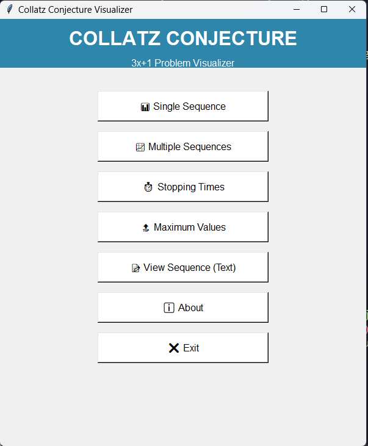
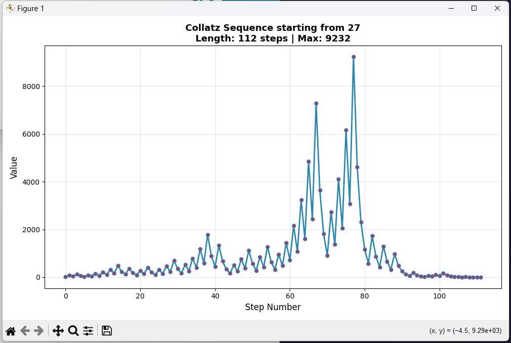
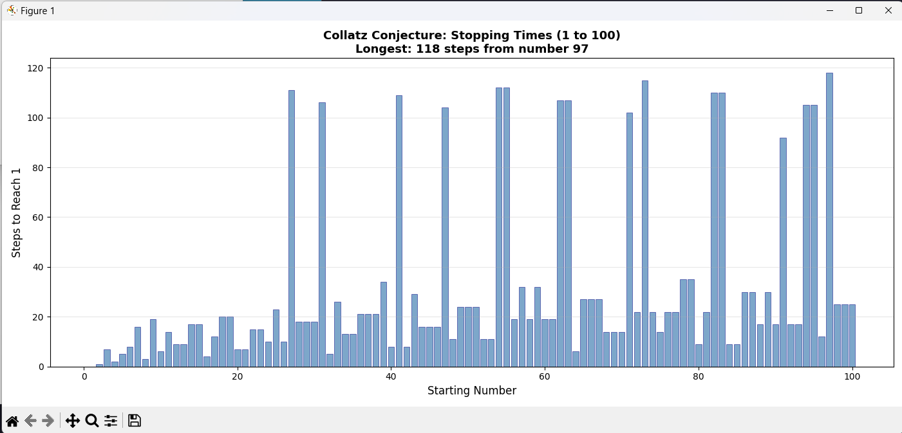
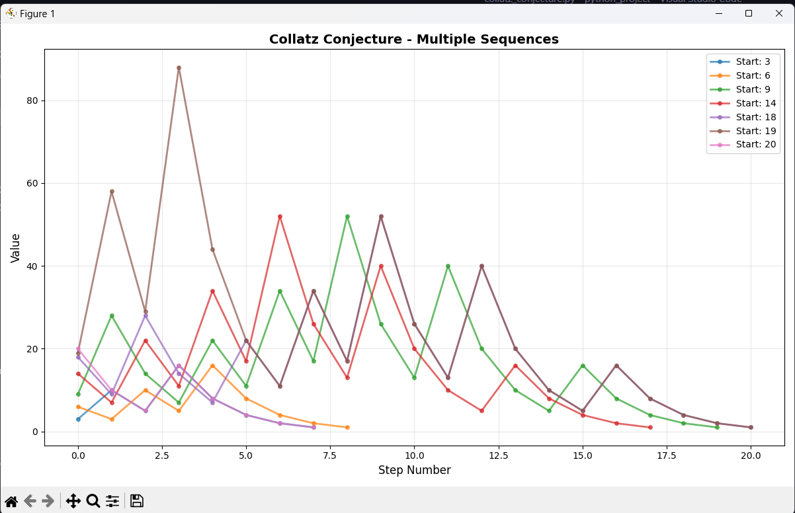

# Collatz Conjecture Visualizer

A Python GUI application for visualizing and analyzing the famous Collatz Conjecture (3x+1 Problem).


## About The Collatz Conjecture

The Collatz Conjecture is one of mathematics' most famous unsolved problems. Despite its simple rules, no one has been able to prove it works for all numbers!

**The Rules:**
- Start with any positive integer n
- If n is even: divide it by 2
- If n is odd: multiply by 3 and add 1
- Repeat until you reach 1

**Example:** Starting with 7
```
7 → 22 → 11 → 34 → 17 → 52 → 26 → 13 → 40 → 20 → 10 → 5 → 16 → 8 → 4 → 2 → 1
```

## Features

- **Single Sequence Visualization** - Watch how a single number progresses through the sequence
- **Multiple Sequences** - Compare multiple starting numbers on the same graph
- **Stopping Times Analysis** - See how many steps different numbers take to reach 1
- **Maximum Values Analysis** - Discover the peak values reached during each sequence
- **Text View** - View complete sequences in text format
- **Modern GUI** - Easy-to-use graphical interface built with Tkinter

## Screenshots






## Installation

### Prerequisites
- Python 3.7 or higher
- pip (Python package installer)

### Install Dependencies

```bash
pip install numpy matplotlib
```

Or install from requirements file:
```bash
pip install -r requirements.txt
```

## Usage

1. Clone this repository:
```bash
git clone https://github.com/ayushShukla2006/Collatz-Conjecture.git
cd Collatz-Conjecture
```

2. Run the application:
```bash
python collatz_visualizer.py
```

3. Use the GUI to explore:
   - Click any button to open that feature
   - Enter numbers as prompted
   - Visualizations will open in new windows
   - Close windows when done to return to the menu

## Examples

### Visualize a Single Number
1. Click "Single Sequence"
2. Enter a number (try 27 for an interesting sequence!)
3. Click "Visualize"

### Compare Multiple Numbers
1. Click "Multiple Sequences"
2. Enter numbers separated by commas: `7,15,27`
3. Choose normal or log scale
4. Click "Visualize"

### Analyze Patterns
1. Click "Stopping Times" or "Maximum Values"
2. Enter a range (e.g., 100 to analyze numbers 1-100)
3. Click "Analyze"

## Project Structure

```
Collatz-Conjecture/
│
├──Screenshots              #Screenshots
├── collatz_visualizer.py   # Main application file
├── README.md                # This file
└── requirements.txt         # Python dependencies
```

## Requirements

```
numpy>=1.21.0
matplotlib>=3.4.0
```

## How It Works

The application uses:
- **Tkinter** - For the graphical user interface
- **Matplotlib** - For creating interactive visualizations
- **NumPy** - For numerical computations (via matplotlib)

The core algorithm implements the Collatz conjecture rules and tracks each step of the sequence until it reaches 1.

## Contributing

Contributions are welcome! Feel free to:
- Report bugs
- Suggest new features
- Submit pull requests

## Future Enhancements

- [ ] Save visualizations as images
- [ ] Export sequences to CSV
- [ ] 3D visualizations
- [ ] Animation of sequence progression
- [ ] Dark mode support
- [ ] Comparison statistics

## Acknowledgments

- This project was inspired by the Veritasium video “The Simplest Math Problem No One Can Solve – Collatz Conjecture” on YouTube.
- Built as a learning project to explore GUI development and data visualization in Python

## Author

Created by Ayush Shukla(Mehroom)

## Links

- [GitHub Repository](https://github.com/ayushShukla2006/Collatz-Conjecture)
- [Report Issues](https://github.com/ayushShukla2006/Collatz-Conjecture/issues)

---

⭐ If you found this project interesting, please consider giving it a star on GitHub!

